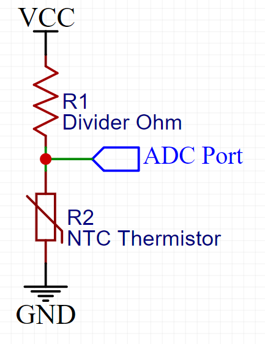

# Micropython Generic Thermistor Library

Micropython Generic Thermistor Library is a basic software module designed to simplify temperature sensing using NTC thermistors within MicroPython-based projects. The library assumes a generic NTC thermistor on the ground side of a voltage divider. It provides functions for converting raw analog sensor readings into temperature values, taking into account the non-linear nature of thermistors using the β parameter equation.

## Features
- Temperature output in Kelvin, Celsius, or Fahrenheit
- Checks for thermistor shorts to VCC or GND
- Checks for reasonable output values as specified in Constants
- New thermistors only require one line of code!

## Installation - Hardware
Figure 1 demonstrates the expected wiring scheme. 
R1 and the thermistor cannot be swapped with this library; 
the code assumes the thermistor is on the ground side of the voltage divider.



Notes:
- The resistance of R1 should be similar to the nominal resistance of the thermistor
- Thermistor nominal resistance and beta values can be found on the thermistor datasheet
- Thermistor is assumed to be NTC

## Installation - Software
1. Have a Micropython environment set up on something; for example, an ESP32
2. Upload the thermistor.py file onto the Micropython device; upload steps vary based on familiarity with the terminal, OS, and/or IDE. You can create a new file named thermistor.py on the embedded device and copy-paste the code into the file.
3. Configure the object constructor "Thermistor" with your values. The below example is using pin 4 on an ESP 32 with a 10k ohm NTC, beta=3425, thermistor and 10k ohm voltage divider. Make sure you use your own values here!
```python
therm = Thermistor(ADC(4, atten=ADC.ATTN_11DB), beta=3435, therm_ohm=10_000, divider_ohm=10_000)
```
4. See the example main.py file

## Warnings
- This code was only tested on a single ESP32, with a single version of Micropython. Your mileage may vary.
- This code does not have thermal runaway protection; use heating devices at your own risk.


